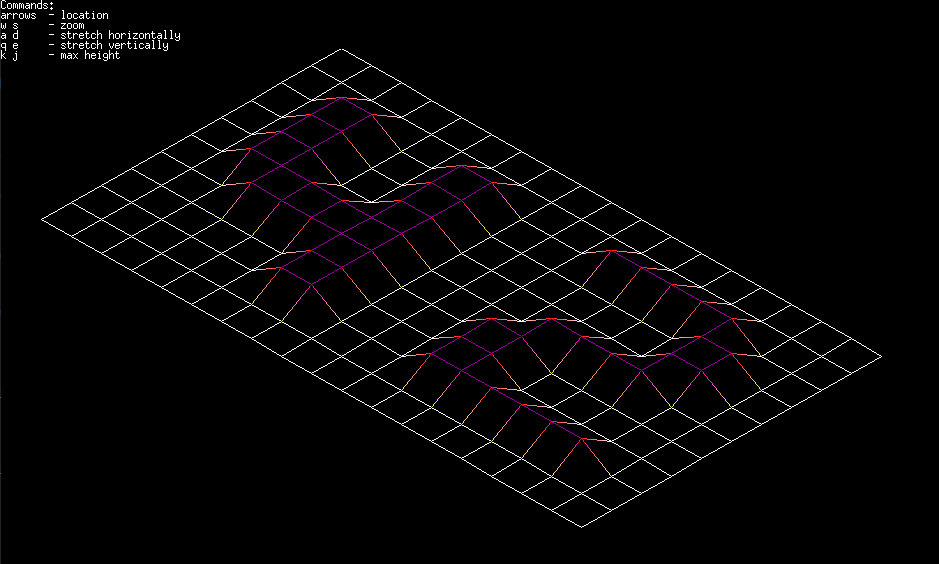

# FDF - Representing 3D maps

This project serves as an introduction to graphical applications by using [42's minilibx](https://github.com/42Paris/minilibx-linux) library.

The program reads a formatted geographical map, such as [42.fdf](fdf), and interprets it into a 3D grid. You are able to read any map in this fashion! For example, you could represent your own city, provided the map is formatted properly. This could be retrieved from a topography API, such as what jgigault [was able to accomplish](https://github.com/jgigault/42MapGenerator).

- - -

## What i learned?

After creating various string manipulation functions this is the first project where you can see a real application for everything we learned so far at 42SP, structuring it in a bigger project.

Throughout the project i translated some geometrical concepts to give an impression of isometry and adapt Bresenham's algorithm, used to this day in graphics drivers to draw lines between two points.

You are also tasked to implement features that reads user interaction with the keyboard and mouse in order to redraw the entire image according to the users' specifications.

## My badge

## My grade

## Requirements

* gcc
* clang
* make
* xorg
* libxext-dev
* zlib1g-dev
* linux or macOS with graphical interface support

If necessary, install these with:

`sudo apt-get update && sudo apt-get install clang gcc make xorg libxext-dev zlib1g-dev`

## How to use

Clone the repository:

`git clone --recurse-submodules https://github.com/VLN37/fdf`

Compile the program with:

`make`

Run with any map you want. Some examples are:

`./fdf 42.fdf`

`./fdf maps/0.fdf`

Other sample maps are provided in the maps folder.

## License

Minilibx is licensed under the BSD terms, [available here](https://github.com/42Paris/minilibx-linux/blob/master/LICENSE)

This project is licensed under the BSD terms, [available here](LICENSE)
